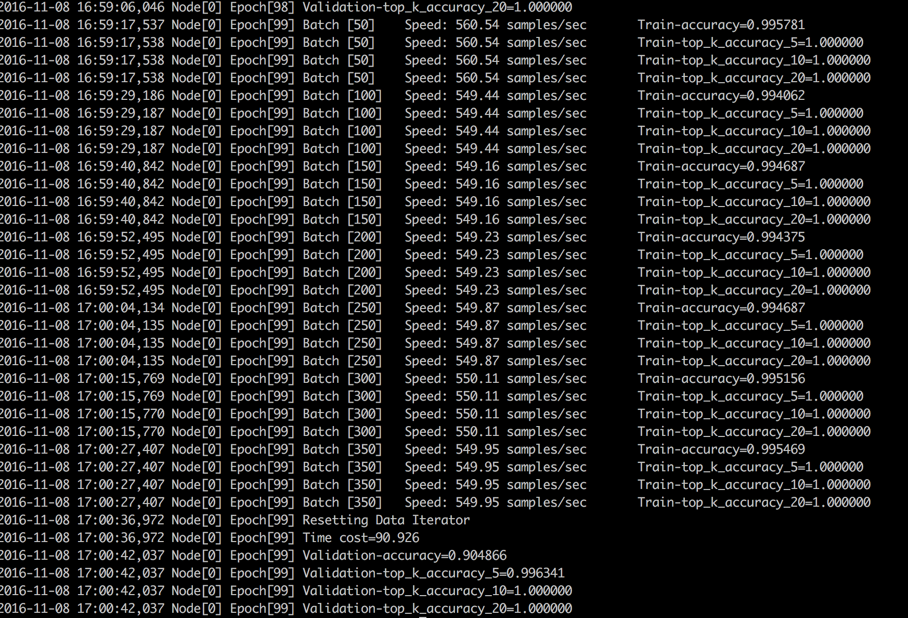

## train_mnist_mlp.py
get_mlp() return a mlp network, and the get_iterator return the mnist dataset iterator.

Some detailed infomation seen in [mxnet io](http://mxnet.io/api/python/io.html#)

## train_model.py
Configurate the log:

    head = '%(asctime)-15s Node[' + str(kv.rank) + '] %(message)s'
    logging.basicConfig(level=logging.DEBUG, format=head)
    logging.info('start with arguments %s', args)

the compute devices:

    devs = mx.cpu() if args.gpus is None else [
    mx.gpu(int(i)) for i in args.gpus.split(',')]

Set the model run params(devices, network, num_poch, lr, momentum, wd,initializer):

    model = mx.model.FeedForward(
        ctx                = devs,
        symbol             = network,
        num_epoch          = args.num_epochs,
        learning_rate      = args.lr,
        momentum           = 0.9,
        wd                 = 0.00001,
        initializer        = mx.init.Xavier(factor_type="in", magnitude=2.34),
        **model_args
        )
FeedForward.optimizer default set to sgd.

Set the metrics:

    eval_metrics = ['accuracy']
    ## TopKAccuracy only allows top_k > 1
    for top_k in [5, 10, 20]:
        eval_metrics.append(mx.metric.create('top_k_accuracy', top_k = top_k))

Set the callback of the batch_end_callback, when the end of epoch it will be invoked.

    batch_end_callback.append(mx.callback.Speedometer(args.batch_size, 50))

## train_cifar10.py
In order to learn how to create a data iterator, we use the cifar10 dataset instead of mnist dataset.

The model in train_cifar10.py is too complicated to run on my RMBP, so I run it in my cloud host:

## Summary
 - Know how to run the mlp in MXnet, read the train_model.py and train_mnist_mlp.py
 - Know how to create a data iterator by `mx.io.ImageRecordIter` instead of using the `mx.io.MNISTIter`

## Day2 goal
 - Know how to convert the Image data to `rec`
 - Be familiar with the layers in MXnet