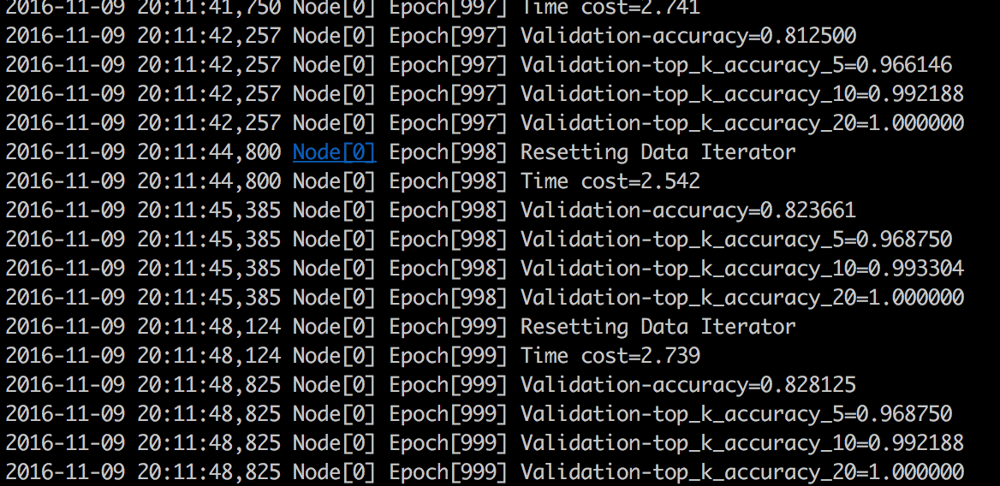

## How to covert the dataset to binary file

### Prepare the dataset

I use the 17flowers, which has the follow folder structure:

    17flowers/0/image_0001.jpg
    17flowers/1/image_0081.jpg
    ...

### Prepare the image lst
First, gen a image list like this(`integer_image_index \t label_index \t path_to_image`):

    895099  464     n04467665_17283.JPEG
    10025081        412     ILSVRC2010_val_00025082.JPEG
    74181   789     n01915811_2739.JPEG
    10035553        859     ILSVRC2010_val_00035554.JPEG
    10048727        929     ILSVRC2010_val_00048728.JPEG
    94028   924     n01980166_4956.JPEG
    1080682 650     n11807979_571.JPEG
    972457  633     n07723039_1627.JPEG
    7534    11      n01630670_4486.JPEG
    1191261 249     n12407079_5106.JPEG

The script to gen the image list `gen_images_list.py` shuffle and spilt the img dataset to train and test lst, and then use im2rec to gen binaray file,the im2rec params:

### Gen the binary file

    ./im2rec
    color=USE_COLOR[default=1] Force color (1), gray image (0) or keep source unchanged (-1).                                                                                                    
    resize=newsize resize the shorter edge of image to the newsize, original images will be packed by default                                                                                    
    label_width=WIDTH[default=1] specify the label_width in the list, by default set to 1                                                                                                        
    pack_label=PACK_LABEL[default=0] whether to also pack multi dimenional label in the record file                                                                                              
    nsplit=NSPLIT[default=1] used for part generation, logically split the image.list to NSPLIT parts by position                                                                                
    part=PART[default=0] used for part generation, pack the images from the specific part in image.list                                                                                          
    center_crop=CENTER_CROP[default=0] specify whether to crop the center image to make it square.                                                                                               
    quality=QUALITY[default=80] JPEG quality for encoding (1-100, default: 80) or PNG compression for encoding (1-9, default: 3).                                                                
    encoding=ENCODING[default='.jpg'] Encoding type. Can be '.jpg' or '.png'                                                                                                                     
    inter_method=INTER_METHOD[default=1] NN(0) BILINEAR(1) CUBIC(2) AREA(3) LANCZOS4(4) AUTO(9) RAND(10).                                                                                        
    unchanged=UNCHANGED[default=0] Keep the original image encoding, size and color. If set to 1, it will ignore the others parameters.

the command to gen binary files:

    ./im2rec train.lst /Users/burness/git_repository/dl_opensource/mxnet-101/day2/ train.rec resize=224
    ./im2rec test.lst /Users/burness/git_repository/dl_opensource/mxnet-101/day2/ test.rec resize=224 

## How to use the `rec` files

    def get_iterator(args, kv, data_shape=(3, 224, 224)):
        data_dir = args.data_dir
        train           = mx.io.ImageRecordIter(
            path_imgrec = os.path.join(args.data_dir, "train.rec"),
            mean_img = os.path.join(args.data_dir, "mean.bin"),
            data_shape = data_shape,
            batch_size = args.batch_size,
            rand_crop = True,
            rand_mirror = True,
            num_parts = kv.num_workers,
            part_index = kv.rank
        )

        val = mx.io.ImageRecordIter(
            path_imgrec = os.path.join(args.data_dir, "test.rec"),
            mean_img    = os.path.join(args.data_dir, "mean.bin"),
            rand_crop   = True,
            rand_mirror = True,
            data_shape  = data_shape,
            batch_size  = args.batch_size,
            num_parts   = kv.num_workers,
            part_index  = kv.rank)

        return (train, val)

`mx.io.IamgeRecordIter` can set the path_imgrec.

## Run the train_17flowers

*issue 1*: the validation-accuracy always be 0.062500.
I check the params and change the  param shuffle to be True, it will change but not be Convergence.
Then, I make the lr be small and it's ok to be convergence.

## Summary

 - Know how to gen binary from dataset.
 - Know how to use `rec` with api `mx.io.ImageRecordIter`
 - Be familiar with layers in `symbol_alexnet`

## Day3 Goals 

 - Run serveral dataset example (inception-resnet-v2 writed by me?)
 - Know how to plot the train curves and test curves generated by the log
 

